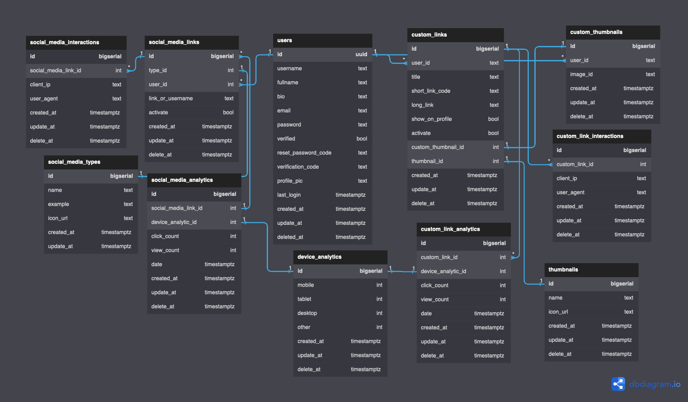

# Pendek.In Backend API
## Technical Stack
- Web Framework : [GIN](https://github.com/gin-gonic/gin)
- Database : PostgreSQL & Redis
- Aauthentication : [JWT](https://github.com/golang-jwt/jwt)
- ORM : [GORM](https://github.com/go-gorm/gorm)
- Redis Client : [go-redis](https://github.com/go-redis/redis)
- Mail Client : [Gomail](https://github.com/go-gomail/gomail)
- Testing Tools : [Testify](https://github.com/stretchr/testify) & [Mockery](https://github.com/vektra/mockery) 
- Validator : [Validator/V10](https://github.com/go-playground/validator)
- Configuration : [Viper](https://github.com/spf13/viper)
- Logger : [Zerolog](https://github.com/rs/zerolog) & [lumberjack](https://github.com/natefinch/lumberjack)
(rolling logger)
- Virtualization : Docker
- Implement Clean Architecture : Controller -> Service -> Repository
## API Documentation
Postman Page Link : [Click Here](https://documenter.getpostman.com/view/19656549/2s8YzL4meW)

[Download Postman Collection](postman/pendekin-backend-postman-collection.json)

## Database Diagram


## Folder Structure
## Folder Structure
```
.
├── app
│   ├── cache        // redis client
│   ├── database     // orm client
│   ├── logger       // logger client
│   ├── mail         // mail client
│   ├── router       // endpoint management
│   └── main.go
| 
├── config             // app configuration                 
├── doc-assets         // documentation assets
├── helper             // helper function for hashing password, user-agent parser, etc.
├── internal           
│   ├── controller      // server handler layer
│   ├── handler         // internal server error, no method, and no route handler.
│   ├── middleware      // jwt middleware layer
│   ├── model          
|   |   ├─ domain       // data and table structure for database
|   |   └─ web          // request and response interface     
│   ├── repository      // responsible for all CRUD operations 
|   └── service         // business logic layer 
|       ├─ user_service*.go   // responsible for account management (sign-up, login, etc)
|       ├─ custom_link_*_service*.go   // responsible for custom link and analytic logic
|       └─ social_media_*_service*.go   // responsible for social media link and analytic logic
├─- .env // container level configuration
├── docker-compose.yaml // multi-container configuration
└── Makefile // list of automation commands
 ```
